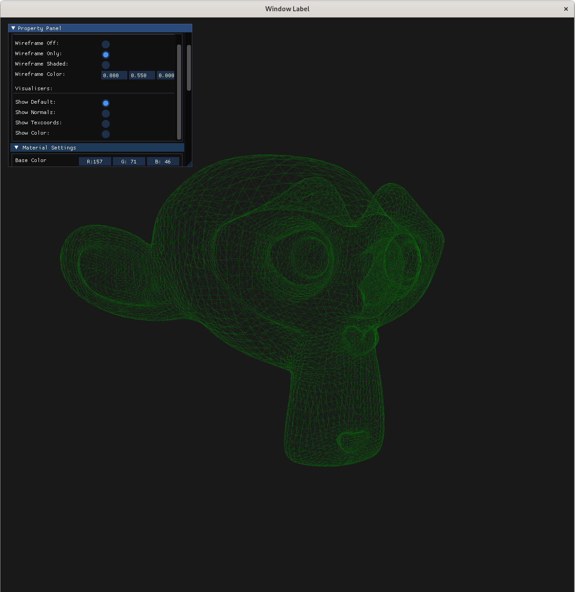
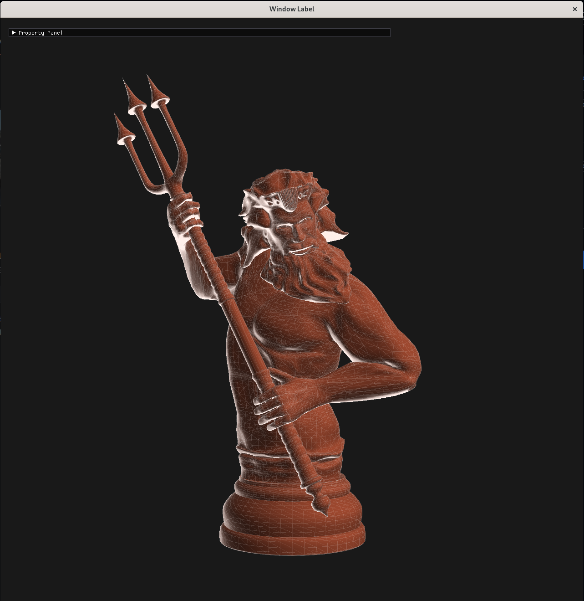
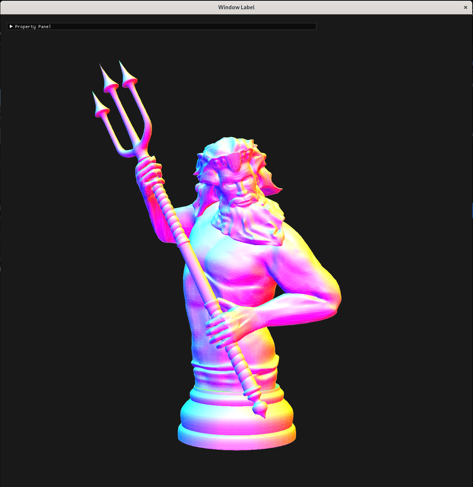

Pyrousel - Python based 3D model visualiser
--------------------------------
Personal project still in progress, an excuse to try modern OpenGL & GLFW with Python

Instalation (Linux Bash)
------------------
``` Bash
# Dowload package & install
git clone https://github.com/RealDanTheMan/pyrousel
cd pyrousel
python -m pip install .

# Run Pyrousel
python -m pyrousel
```

Installation (Windows PowerShell)
----------------------
``` PowerShell
# Dowload package & install
Invoke-WebRequest -Uri "https://github.com/RealDanTheMan/pyrousel/archive/refs/heads/dev.zip" -OutFile "pyrousel.zip"
Expand-Archive -Path "pyrousel.zip" -DestinationPath ".\\pyrousel\\"
cd .\\pyrousel\\pyrousel-dev\\
py -m pip install .

# Run Pyrousel
py -m pyrousel
```

Examples
--------

<br>
<div style="display: flex; justify-content: space-between;">
  
  
  
  
</div>
<br>
<div style="display: flex; justify-content: space-between;">
  
  
  
  
</div>
<br>
<div style="display: flex; justify-content: space-between;">
  
  
  
  
</div>
<br>
<div style="display: flex; justify-content: space-between;">
  <p>Full Property Panel</p>
  
</div>
