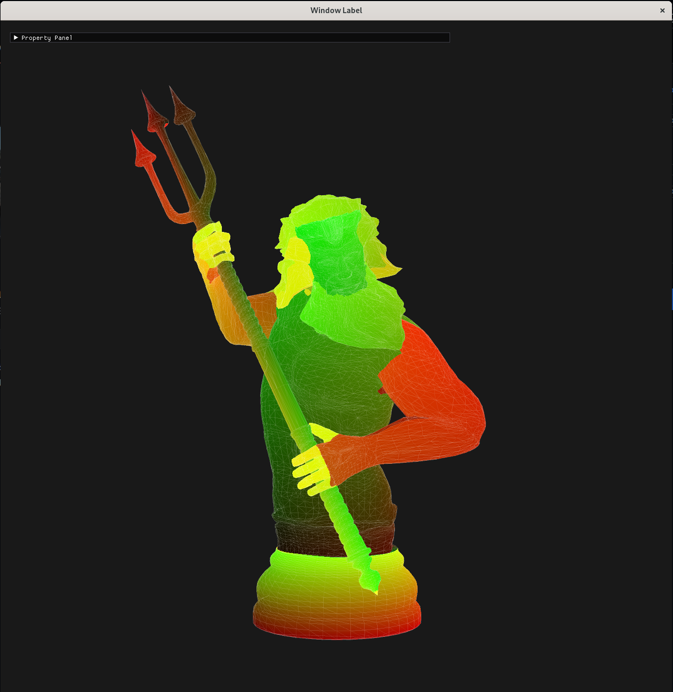
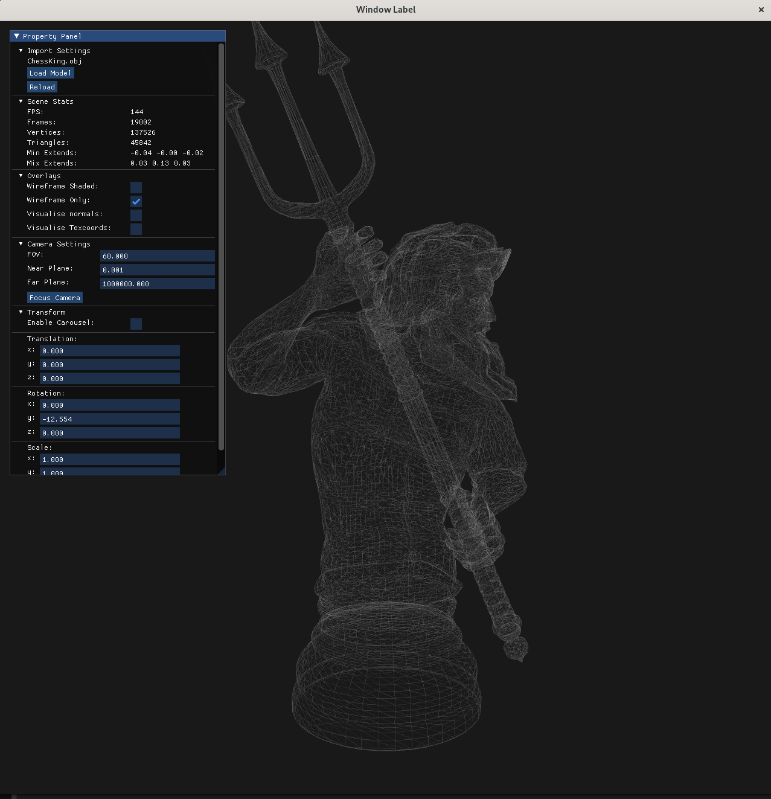
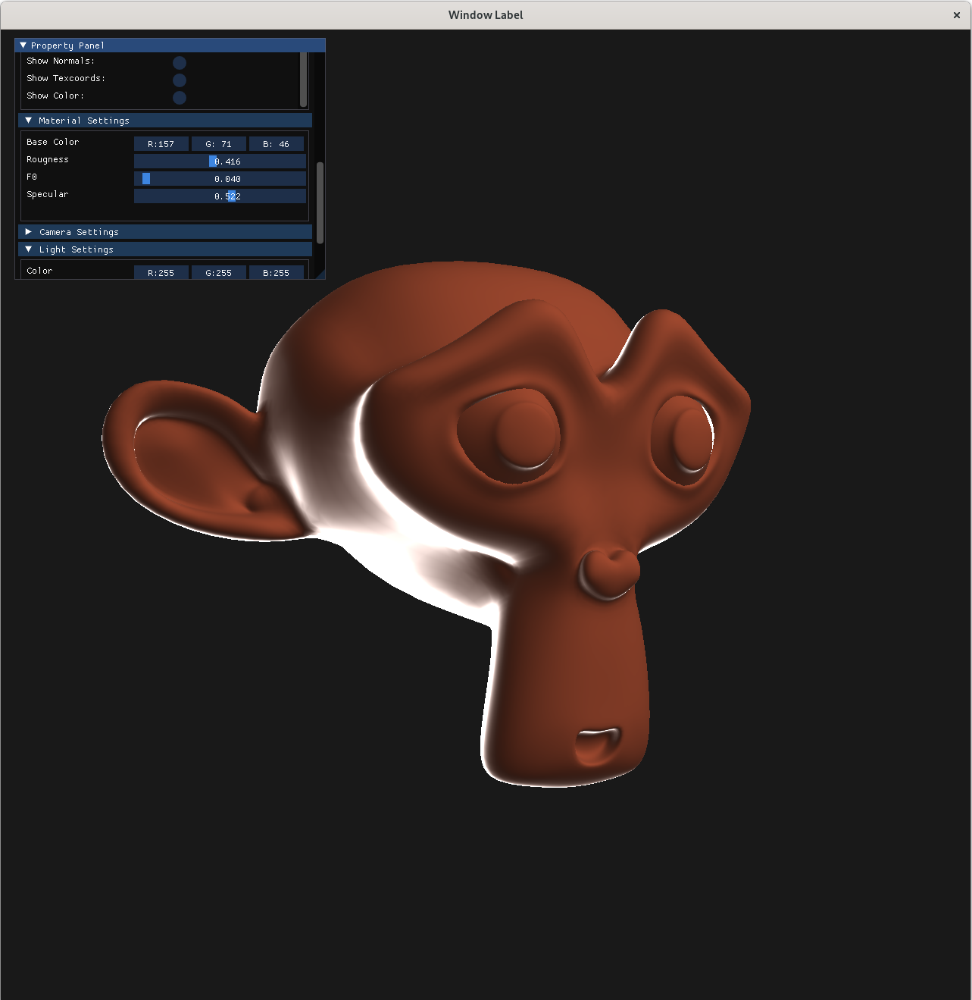
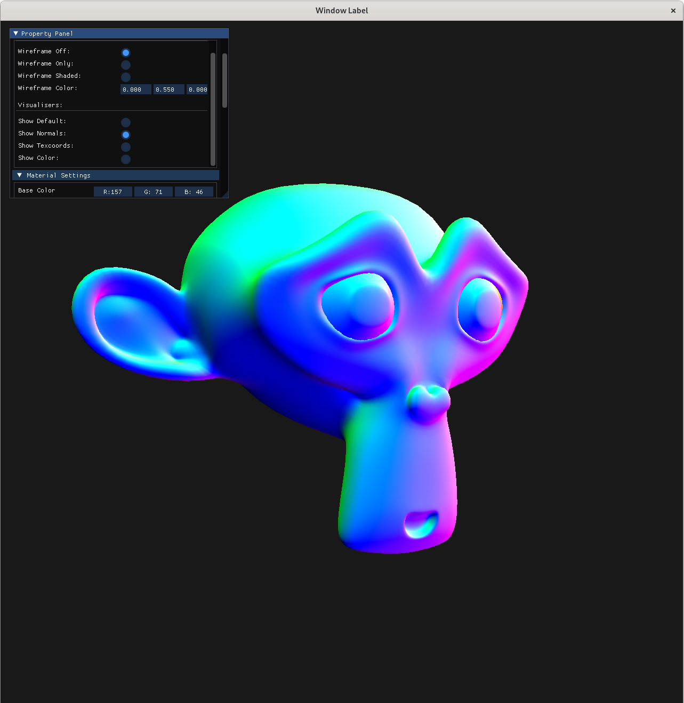

Pyrousel - Python based 3D model visualiser
--------------------------------
Personal project still in progress, an excuse to try modern OpenGL & GLFW with Python

 

  
  
  
  

 

  
  
  
  

